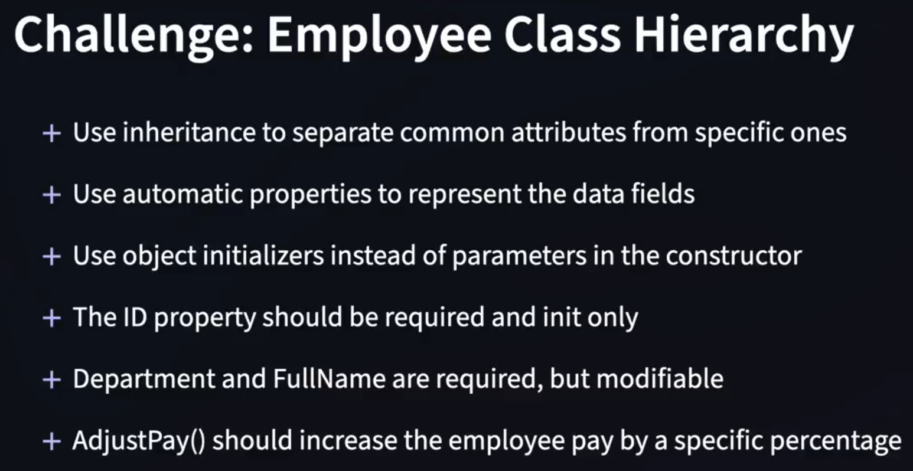
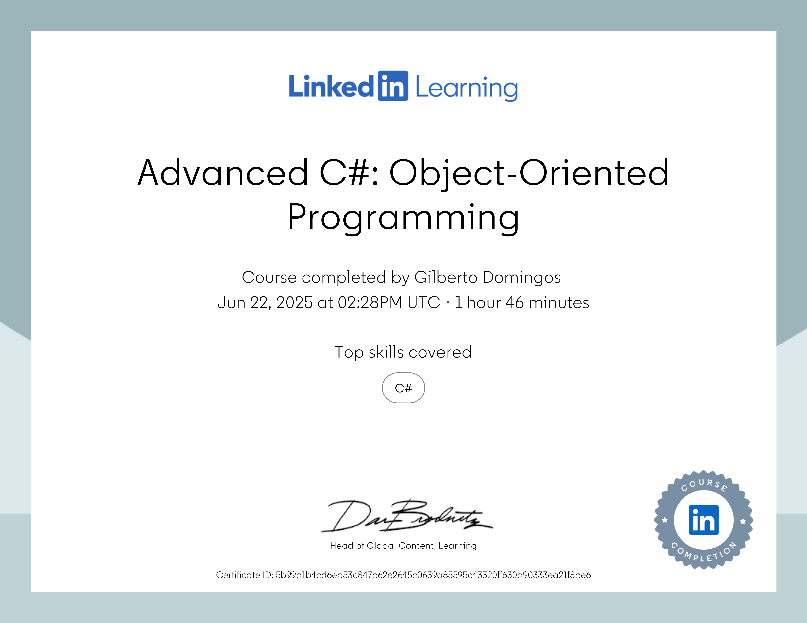

# Curso avançado ministrado por Joe Marini
Technology Industry Veteran

- Ocupou cargos de destaque em diversas empresas do Vale do Silício, incluindo Microsoft, Adobe, Google e Databricks.

- Joe Marini tem mais de 35 anos de experiência no setor de tecnologia é autor de diversos livros e mais de 40 cursos educacionais sobre desenvolvimento de software.

- Conheça Joe Marini : https://www.linkedin.com/in/joemarini/?trk=lil_instructor

## Advanced C#: Object-Oriented Programming
This is the repository for the LinkedIn Learning course Advanced C#: Object-Oriented Programming. 
![C# Avançado: Programação Orientada a Objetos][lil-thumbnail-url]

### Instrutor

Joe Marini

[lil-course-url]: https://www.linkedin.com/learning/advanced-c-sharp-object-oriented-programming
[lil-thumbnail-url]: https://media.licdn.com/dms/image/D560DAQFEKONg7FNiDw/learning-public-crop_675_1200/0/1696534679389?e=2147483647&v=beta&t=3gmbZp31_rWONSurpbxaSgCAABJd1QUvGrwfY3eebTA

[lil-course-url]: https://www.linkedin.com/learning/
[lil-thumbnail-url]: http://

*** 
<h1 align="center">Desafio ! </h1>

### * No meio do curso Joe Marini faz um desafio, conforme consta nas imagens :

 Não pode usar parâmetros no construtor !

Como você faria ?

### Leia o desafio nas imagens :

   
  

