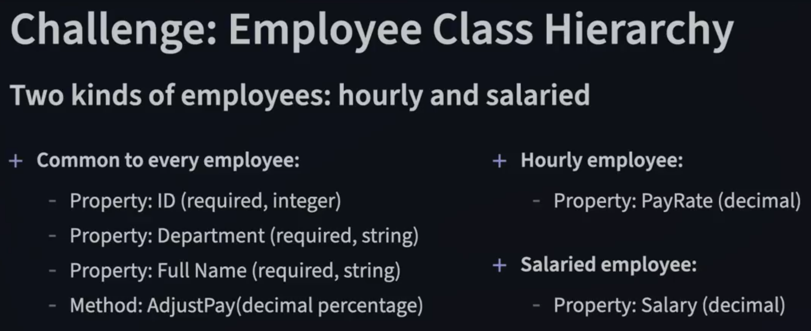
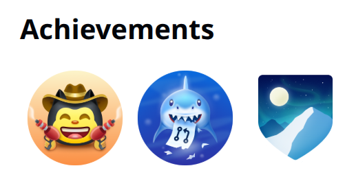

# Curso avançado ministrado por Joe Marini
Technology Industry Veteran

- Ocupou cargos de destaque em diversas empresas do Vale do Silício, incluindo Microsoft, Adobe, Google e Databricks.

- Joe Marini tem mais de 35 anos de experiência no setor de tecnologia é autor de diversos livros e mais de 40 cursos educacionais sobre desenvolvimento de software.

- Conheça Joe Marini : https://www.linkedin.com/in/joemarini/?trk=lil_instructor

## Advanced C#: Object-Oriented Programming
This is the repository for the LinkedIn Learning course Advanced C#: Object-Oriented Programming. The full course is available from [LinkedIn Learning][lil-course-url].

![C# Avançado: Programação Orientada a Objetos][lil-thumbnail-url]

 Este repositório contém duas pastas para o conteúdo do curso:
- 
- *Concluído* : As versões totalmente concluídas dos exemplos de código. Destinado a ser usado como referência e para ajudar na solução de problemas do seu próprio código.

- *Início* : O ponto de partida para cada exercício. Este é o código que você usará no curso para construir os exemplos concluídos.

1. Para usar estes arquivos de exercícios localmente em seu computador, você precisa ter o .NET SDK instalado.

2. Clone este repositório em sua máquina local usando o terminal ou uma ferramenta gráfica como o SourceTree.

3. Sugerimos usar o Visual Studio Code como editor, mas qualquer editor de texto funcionará.

### Instrutor

Joe Marini

[lil-course-url]: https://www.linkedin.com/learning/advanced-c-sharp-object-oriented-programming
[lil-thumbnail-url]: https://media.licdn.com/dms/image/D560DAQFEKONg7FNiDw/learning-public-crop_675_1200/0/1696534679389?e=2147483647&v=beta&t=3gmbZp31_rWONSurpbxaSgCAABJd1QUvGrwfY3eebTA

[lil-course-url]: https://www.linkedin.com/learning/
[lil-thumbnail-url]: http://

*** 
<h1 align="center">Desafio ! </h1>

### * No meio do curso Joe Marini faz um desafio, conforme consta nas imagens após o texto :
  Desafio: Hierarquia da Classe Employee
  Este desafio propõe a construção de uma hierarquia de classes em C# para representar dois tipos de funcionários: horistas e assalariados, utilizando conceitos de orientação a objetos e boas práticas modernas.

Requisitos Comuns (Classe Base: Employee)
Todos os funcionários devem possuir os seguintes membros:

Propriedade ID (obrigatória, do tipo int)

Propriedade Department (obrigatória, do tipo string)

Propriedade FullName (obrigatória, do tipo string)

Método AdjustPay(decimal percentage): ajusta o pagamento do funcionário com base em uma porcentagem

Funcionário Horista (HourlyEmployee)
Deve conter a seguinte propriedade específica:

Propriedade PayRate (decimal): valor da remuneração por hora trabalhada

Funcionário Assalariado (SalariedEmployee)
Deve conter a seguinte propriedade específica:

Propriedade Salary (decimal): valor fixo do salário (mensal ou anual)

Regras de Implementação
Utilizar herança para separar os atributos comuns dos atributos específicos

Utilizar propriedades automáticas (auto-properties) para representar os campos de dados

Utilizar inicialização por objeto (object initializers) ao invés de construtores com parâmetros

A propriedade ID deve ser obrigatória (required) e somente leitura (init only)

As propriedades Department e FullName devem ser obrigatórias (required) e modificáveis (set)

O método AdjustPay() deve aumentar o pagamento do funcionário com base na porcentagem fornecida
- imagens orginais do desafio proposto no curso:

   
  

- Se você é Sênior e quiser deixar uma sugestão de melhoria mesmo que seja simples fique a vontade.
- Faça um fork, crie uma branch de feature, Implemente sua melhoria, Envie um Pull Request para a branch main.
***
#### - Para programadores novatos e juniors, valendo uma recomendação no Linked-in.
- Guia oficial do GitHub para aprender a contribuir com open source, aprender a trabalhar 'home office' profissionalmente: https://docs.github.com/en/get-started/exploring-projects-on-github/contributing-to-a-project
- Conquiste suas badges(Distintivos) seja um programador mais valorizados recrutadores de empresas grandes de tecnologia valorizam muito isso, mesmo se você tem preferência por contratações PJ.

  

<h2 align="center">Minha conclusão sobre o curso </h2>
- Interessante percerber pelos seus hábitos de codificar que os veteranos vem de uma era onde tudo era diferente. Esses caras passaram por uma época onde ainda nem existia POO(Programação Orientada a Objetos). "Conhecimento muito expandido e abrangente"

Siga o perfil para receber mais curiosidades :
https://github.com/gilberto-domingos